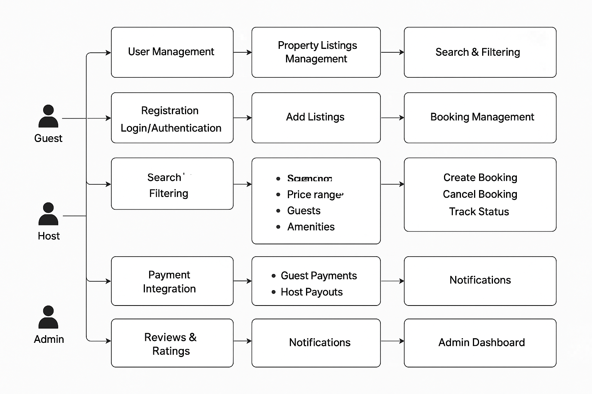

# Airbnb Clone Backend - Features & Functionalities

This document outlines the core and technical features required for the Airbnb Clone backend.

## Core Functionalities
1. User Management
2. Property Listings Management
3. Search & Filtering
4. Booking Management
5. Payment Integration
6. Reviews & Ratings
7. Notifications
8. Admin Dashboard

## Technical Requirements
- Database: PostgreSQL/MySQL
- API: RESTful (optionally GraphQL)
- Authentication: JWT, Role-based Access
- File Storage: AWS S3 / Cloudinary
- Third-party Services: Email notifications
- Error Handling & Logging

## Non-Functional Requirements
- Scalability
- Security
- Performance Optimization
- Testing

## Features Diagram

