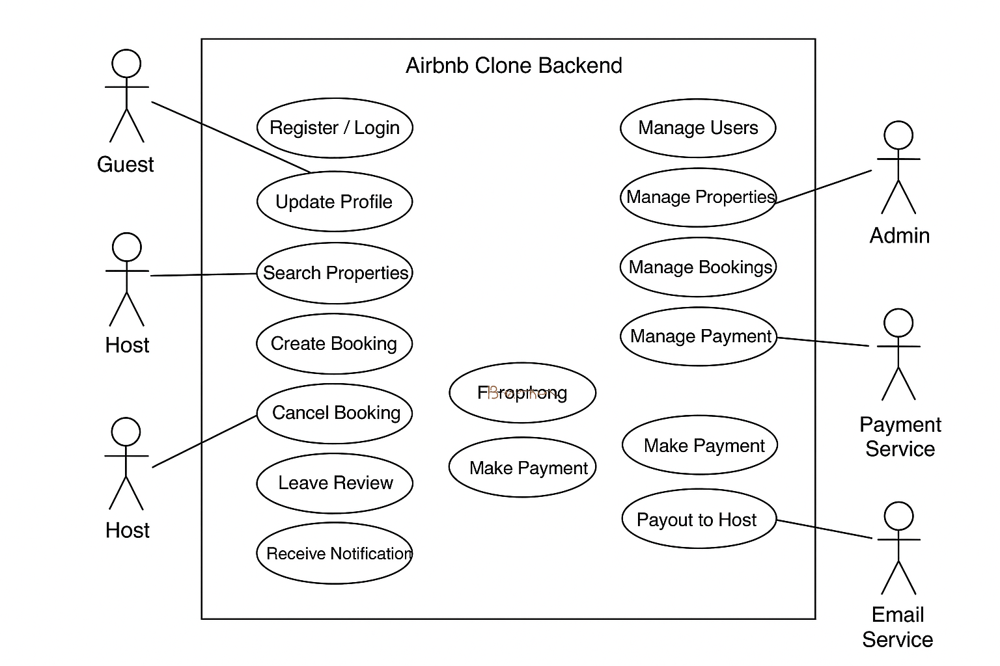

# Airbnb Clone Backend - Use Case Diagram

This document visualizes the interactions between different actors and the Airbnb Clone backend system. The use case diagram highlights key functionalities and how users and services interact with the system.

## Actors
- **Guest**: A user who books properties.
- **Host**: A user who lists and manages properties.
- **Admin**: Manages users, listings, bookings, and payments.
- **Payment Service**: Handles payment processing (e.g., Stripe, PayPal).
- **Email Service**: Sends notifications to users.

## Use Cases
- **User Registration & Login**
- **Profile Management**
- **Create/Edit/Delete Property Listings**
- **Search Properties**
- **Book Property**
- **Cancel Booking**
- **Make Payment**
- **Receive Notifications**
- **Leave Reviews / Respond to Reviews**
- **Admin Management (Users, Properties, Bookings, Payments)**

## Use Case Diagram
The diagram below shows how each actor interacts with the system and its functionalities:

